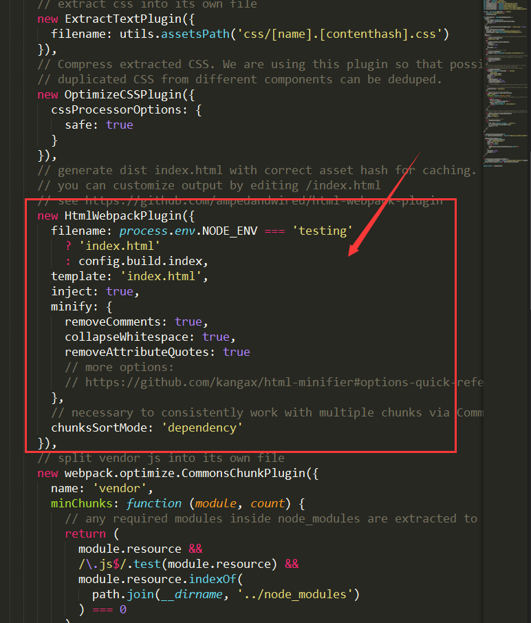

# 命令
	
### 安装vue-cli(快速创建项目模板的脚手架工具)

``` bash
$ npm install -g vue-cli
```

### 初始化vue+webpack项目

``` bash
$ vue init webpack projectName
```
在安装的过程中会出现一些选项。主要是一些设置和模块的安装。成功后，npm install 安装modules，npm run dev(启动)

<!-- more -->
### 目录调整
创建的项目模板是单页面应用的，与多页面应该还有些差别，需要做些调整。


在src文件下增加module文件夹，存放模块入口文件。index文件内、android文件内、module根目录。将index.html,main.js,App.vue,router(路由文件),asset(资源文件)分别放在三个入口的文件内。html和js名字改成与文件名一致。

### 配置webpack文件

##### build/webpack.base.conf.js文件

``` bash
......此处省略
var vueLoaderConfig = require('./vue-loader.conf')

//  1、多入口文件配置
var glob = require('glob');
var entries = getEntry(['./src/module/**/*.js','./src/index.js']); 

function resolve (dir) {
  return path.join(__dirname, '..', dir)
}

module.exports = {
  entry:entries,// 2、修改入口文件
  output: {
    path: config.build.assetsRoot,
    filename: '[name].js',
    publicPath: process.env.NODE_ENV === 'production'
      ? config.build.assetsPublicPath
      : config.dev.assetsPublicPath
  },
  ......此处省略
}

// 3、修改入口文件
function getEntry(globPath) {
  var entries = {},
    basename, tmp, pathname;
  if (typeof (globPath) != "object") {
    globPath = [globPath]
  }
  globPath.forEach((itemPath) => {
    glob.sync(itemPath).forEach(function (entry) {
      basename = path.basename(entry, path.extname(entry));
      if (entry.split('/').length > 4) {
        tmp = entry.split('/').splice(-3);
        pathname = tmp.splice(0, 1) + '/' + basename; // 正确输出js和html的路径
        entries[pathname] = entry;
      } else {
        entries[basename] = entry;
      }
    });
  });
  console.log(entries)
  return entries;
}
```

##### build/webpack.dev.conf.js文件

```bash
......此处省略
var HtmlWebpackPlugin = require('html-webpack-plugin')
var FriendlyErrorsPlugin = require('friendly-errors-webpack-plugin')

// 1、修改入口文件
var path = require('path');
var glob = require('glob')

// add hot-reload related code to entry chunks
Object.keys(baseWebpackConfig.entry).forEach(function (name) {
  baseWebpackConfig.entry[name] = ['./build/dev-client'].concat(baseWebpackConfig.entry[name])
})

module.exports = merge(baseWebpackConfig, {
......此处省略
})

// 2、修改入口文件
function getEntry(globPath) {
  var entries = {},
    basename, tmp, pathname;
  if (typeof (globPath) != "object") {
    globPath = [globPath]
  }
  globPath.forEach((itemPath) => {
    glob.sync(itemPath).forEach(function (entry) {
      basename = path.basename(entry, path.extname(entry));
      if (entry.split('/').length > 4) {
        tmp = entry.split('/').splice(-3);
        pathname = tmp.splice(0, 1) + '/' + basename; // 正确输出js和html的路径
        entries[pathname] = entry;
      } else {
        entries[basename] = entry;
      }
    });
  });
  return entries;
}

var pages = getEntry(['./src/index.html','./src/module/**/*.html']);

for (var pathname in pages) {
  // 配置生成的html文件，定义路径等
  var conf = {
    filename: pathname + '.html',
    template: pages[pathname],   // 模板路径
    inject: true,              // js插入位置
    // necessary to consistently work with multiple chunks via CommonsChunkPlugin
    chunksSortMode: 'dependency'

  };

  if (pathname in module.exports.entry) {
    conf.chunks = ['manifest', 'vendor', pathname];
    conf.hash = true;
  }
  console.log(conf);
  module.exports.plugins.push(new HtmlWebpackPlugin(conf));
}

```

如下图，删除build/webpack.dev.conf.js文件内代码


##### build/webpack.prod.conf.js文件
```bash
......此处省略
var ExtractTextPlugin = require('extract-text-webpack-plugin')
var OptimizeCSSPlugin = require('optimize-css-assets-webpack-plugin')

// 1、修改入口文件
var glob = require('glob');

var env = process.env.NODE_ENV === 'testing'
  ? require('../config/test.env')
  : config.build.env

......此处省略

module.exports = webpackConfig


// 2、修改入口文件
function getEntry(globPath) {
  var entries = {},
    basename, tmp, pathname;
  if (typeof (globPath) != "object") {
    globPath = [globPath]
  }
  globPath.forEach((itemPath) => {
    glob.sync(itemPath).forEach(function (entry) {
      basename = path.basename(entry, path.extname(entry));
      if (entry.split('/').length > 4) {
        tmp = entry.split('/').splice(-3);
        pathname = tmp.splice(0, 1) + '/' + basename; // 正确输出js和html的路径
        entries[pathname] = entry;
      } else {
        entries[basename] = entry;
      }
    });
  });
  return entries;
}
//此处入口文件路径
var pages = getEntry(['./src/index.html','./src/module/**/*.html']);

for (var pathname in pages) {
  // 配置生成的html文件，定义路径等
  var conf = {
    filename: pathname + '.html',
    template: pages[pathname],   // 模板路径
    inject: true,              // js插入位置
    // necessary to consistently work with multiple chunks via CommonsChunkPlugin
    chunksSortMode: 'dependency'
  };

  if (pathname in module.exports.entry) {
    conf.chunks = ['manifest', 'vendor', pathname];
    conf.hash = true;
  }
  console.log(conf);
  module.exports.plugins.push(new HtmlWebpackPlugin(conf));
}

```
如下图，删除build/webpack.prod.conf.js文件内代码


### 运行

```
npm run dev
```


### 心得

webpack配置确实很麻烦，尤其是刚入坑时，完全看不懂，不知从哪下手。网上查了很多资料，代码也是一行一行解读。主要是要掌握配置的方法和思路，插件不懂可以上网查的。有了方法和门路，看起来就容易些了。多动手配置。